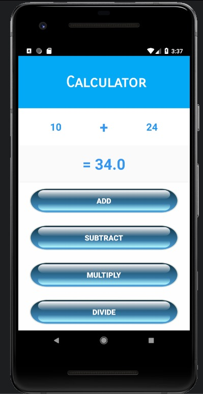

# Calculator App

This a simple **Caculator App**. It is an **Android application**. This app performs **Addition, Subtration, Division, Multiplcation** operations in integers and decimal numbers.

****

**Language used - Java**
**IDE - Android Studio**
****
**Author - Syamgith**
****

## SCREENSHOTS

## Addition

## Subtration

## **Multiplication**

## **Division**

